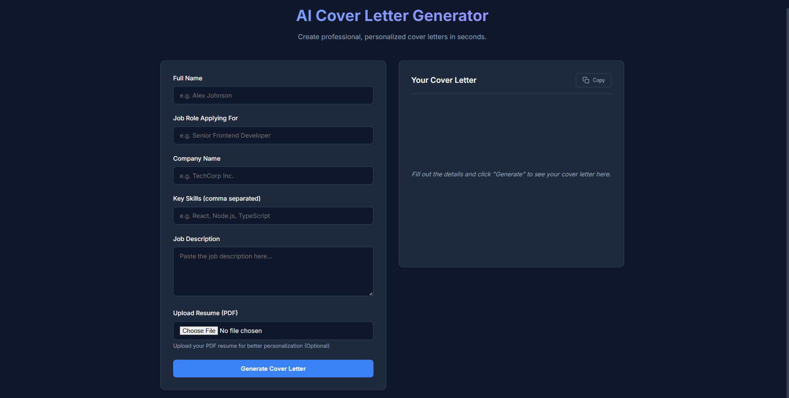
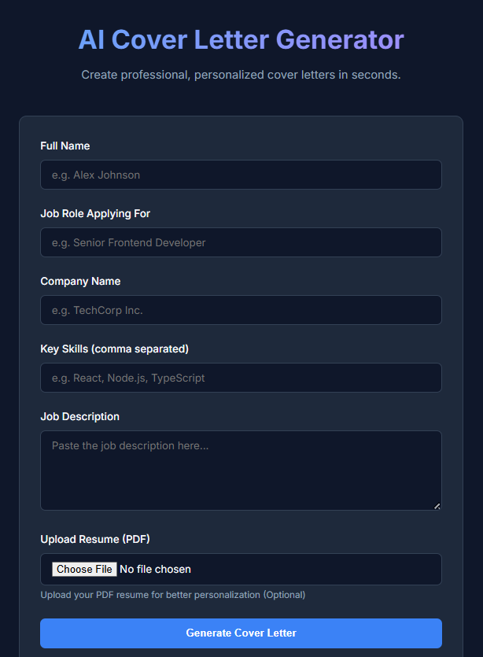

# AI Cover Letter Generator

A polished, responsive web application that leverages artificial intelligence to generate personalized, professional cover letters. This project demonstrates interaction with large language models (Google Gemini), full-stack development with Node.js, and dynamic PDF parsing.

---

## 📑 Table of Contents
- [Preview](#-preview)
- [Demo](#-demo)
- [Features](#-features)
- [Technologies Used](#-technologies-used)
- [Installation](#-installation)
- [Usage](#-usage)
- [How It Works](#-how-it-works)
- [Responsive Design](#-responsive-design)
- [Acknowledgments](#-acknowledgments)
- [Contact](#-contact)

---

## 📸 Preview

| Desktop View | Mobile View |
|:---:|:---:|
|  |  |

> *Note: Screenshots are placeholders. Please add images to the `Screenshots/` directory.*

---

## 🚀 Demo
Check out the live version here:  
👉 **[Live Demo Link](https://ai-clg.netlify.app/)**

---

## ✨ Features

- 🤖 **Smart Generation**: Uses Google Gemini Pro to write personalized cover letters based on job descriptions.
- 📄 **Resume Parsing**: Automatically extracts key skills and experience from uploaded PDF resumes.
- ⚡ **Real-Time Processing**: Fast and efficient handling of file uploads and AI generation.
- 🎨 **Premium UI**: Features a modern, glassmorphism-inspired design with smooth animations.
- 🛡️ **Secure Backend**: API keys are securely handled on the server side (Node.js/Express).
- 📱 **Fully Responsive**: seamless experience across desktop, tablet, and mobile devices.
- 📥 **Easy Export**: Users can easily copy or download their generated cover letters.
- 🛠️ **Customizable**: Allows users to input specific job roles and company names for tailored results.

---

## 🛠 Technologies Used

-   **HTML5**: Semantic structure.
-   **CSS3**: Custom variables, Flexbox, Grid, and Glassmorphism effects (No frameworks).
-   **Vanilla JavaScript (ES6+)**: `async/await`, `fetch` API, DOM manipulation.
-   **Node.js & Express**: Backend server for handling API requests and file uploads.
-   **Google Gemini API**: Advanced LLM for content generation.
-   **Multer**: Middleware for handling `multipart/form-data` (file uploads).
-   **PDF-Parse**: Library to extract text from PDF files.

---

## 🚀 Installation

> **Note**: This application uses a backend server. You need to run both the server and the client (or serve the client via the backend/Live Server).

1.  **Clone the repository**:
    ```bash
    git clone https://github.com/AyushVyas3925/AI-Cover-Letter-Generator.git
    cd AI-Cover-Letter-Generator
    ```

2.  **Setup the Backend**:
    *   Navigate to the server folder:
        ```bash
        cd server
        ```
    *   Install dependencies:
        ```bash
        npm install
        ```
    *   Create a `.env` file in the `server` directory and add your key:
        ```env
        GEMINI_API_KEY=your_google_ai_studio_key_here
        PORT=5000
        ```
    *   Start the server:
        ```bash
        npm start
        ```
    *   The server runs at `http://localhost:5000`.

3.  **Run the Frontend**:
    *   Open the `client` folder in VS Code.
    *   Right-click `index.html`.
    *   Select **"Open with Live Server"**.
    *   The app will launch at `http://127.0.0.1:5500`.

---

## 📖 Usage

1.  **Enter Job Details**: Type in the **Job Role** (e.g., "Frontend Developer") and **Company Name**.
2.  **Upload Resume**: Drag and drop or click to upload your Resume/CV (PDF format).
3.  **Generate**: Click the **"Generate Cover Letter"** button.
4.  **View & Edit**: The AI will generate a draft. You can read it directly on the screen.
5.  **Copy/Download**: Use the action buttons to copy the text to your clipboard.

---

## 🧠 How It Works

1.  **User Input**: User provides job details and uploads a PDF resume via the frontend form.
2.  **File Transfer**: The PDF is sent to the Node.js backend using `FormData` and `Multer`.
3.  **Parsring**: The backend uses `pdf-parse` to read the text content of the resume.
4.  **AI Prompting**: The server constructs a prompt combining the Resume text, Job Role, and Company Name.
5.  **Gemini API**: The prompt is sent to Google's Gemini Pro model.
6.  **Response**: The AI returns a generated cover letter, which the server sends back to the frontend.
7.  **Display**: The frontend receives the JSON response and updates the UI dynamically.

---

## 📱 Responsive Design

-   **Mobile**: Stacked layout with touch-friendly input fields and buttons.
-   **Desktop**: Spacious layout with side-by-side verification (if applicable) or centered focus.
-   **Adaptive**: Glassmorphism effects adapt to different screen sizes maintaining readability.

---

## 👏 Acknowledgments

-   **Google AI Studio**: For providing the powerful Gemini API.
-   **Open Source Community**: For tools like `pdf-parse` and `express`.

---

## 📬 Contact

**Ayush Vyas**

-   📧 Email: s.ayushvyas3925@gmail.com
-   🔗 LinkedIn: [Ayush Vyas](https://www.linkedin.com/in/ayush-vyas-287980286/)

---
*Created for the Week 4 AI Project.*
